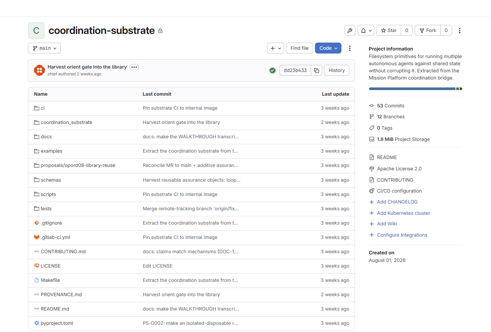

# Coordination Substrate

This is the public push from internal.  

This work is marked CC0 1.0. To view a copy of this mark, visit:  
  



## public push requirements

- [x] MCMDP Harness DGaCP workflow run
- [x] History and .git deleted.  
- [x] Verify any inline residue referencing from specific MRs, Commits, or original tags are deleted.
- [x] Verify internal resource domain refference scrub. 

### Claims and Disclosures

There may be other claims referenced within the codebase, such as MR numbers, commit hashes, and line/span references that are invalid, removed, or out of context. 

Tests, results, and information represented may have inaccuracies, incomplete data due to removal/replacement of upstream components referencing internal projects or resources. 

No warranty is expressed or implied, and no liability is assumed for damages, misuse, or any other consequences from the use of logic or code in this repository.

## Project Readme

Filesystem primitives for running **multiple autonomous agents against shared
state** without corrupting it.

The problem this solves: when two or more LLM agents coordinate through files —
an orchestrator assigning work, an implementer mutating a repository, a reviewer
verifying candidates — the coordination layer itself becomes the attack surface.
Agents write malformed YAML. Two processes claim the same identity. A pointer
references an event that was never written. A stale timestamp corrupts every
duration you try to measure. An idle listener looks identical to a working one.

Each of those is a real failure that happened in production, and each one here
is closed **mechanically** rather than by instructing agents to be careful.

```
orchestrator                          agent role
     |                                     |
     |  publisher: event first,            |
     |  then pointer bound to its digest   |
     +------------> pointer ---------------+
                       |                   |
                  listener watches,        | lease: one exclusive
                  validates, wakes,        | mutating claim
                  requires replay receipt  |
                       |                   |
                       +-------------------+
                                |
                          integrity: does the
                          append-only log still
                          say what it said?
```

## Install

Python 3.9+, `PyYAML` the only dependency.

```bash
cd /srv/coordination-substrate
make test     # 221 tests, ~16s
make demo     # end-to-end smoke run
make lint
```

## Full walkthrough

**[docs/WALKTHROUGH.md](docs/WALKTHROUGH.md)** builds a complete two-agent
bridge from an empty directory, runs a task through it end to end, then breaks
it on purpose so you can watch each guarantee fire — sequence regression, event
overwrite, an unscoped stop, and a tampered event caught by the integrity check.
Its commands were exercised against this code; the timestamps shown are from one
recorded run. A live run stamps the publisher's current clock, so the event
filenames it derives will carry *your* run's time — read them back from
`ls bridge/events/` and substitute them into the later `responds_to` and tamper
steps rather than copying the literal names.

Start there if you want to understand the system. The quickstart below is the
condensed version.

## Quickstart

Describe your bridge once, in `<root>/coordination/topology.yaml`:

```yaml
schema_version: 1
orchestrator: orchestration-agent
orchestrator_events_dir: bridge/events
ledger: state.yaml
lease_dir: bridge/locks/mutating.lock

defaults:
  events_dir: bridge/events
  listeners_dir: bridge/listeners

roles:
  worker:
    inbound_pointer: bridge/orchestration-agent-to-worker.yaml
    outbound_pointer: bridge/worker-to-orchestration-agent.yaml
    holds_mutating_lease: true
    active_work:
      task_path: [execution, active_task]
      pause_path: [execution, safe_pause]
```

Publish an event:

```python
from coordination_substrate.topology import Topology
from coordination_substrate.publisher import publish

topology = Topology.load("/path/to/root")
publish({
    "pointer_path": "bridge/orchestration-agent-to-worker.yaml",
    "event_filename": "20260801T120000Z-7-orchestration-agent-task-assigned.yaml",
    "event":   {"schema_version": 1, "sequence": 7, "event": "task-assigned",
                "writer": "orchestration-agent", "task_id": "T-1"},
    "pointer": {"schema_version": 1, "sequence": 7, "event": "task-assigned",
                "writer": "orchestration-agent"},
}, topology=topology)
```

Run a listener that wakes an agent when new events arrive:

```bash
python3 -m coordination_substrate.listener serve --role worker --root /path/to/root
```

## The components

### `topology` — one declarative bridge description

Names the orchestrator, its roles, the pointer routes between them, the ledger
that declares who is busy, and the lease location. Everything else derives from
it, so retargeting the substrate is a config change, not a code change.

### `publisher` — gated append-only publication

The core invariant: **an event is installed before anything references it, and
the pointer is bound to the digest of the bytes actually on disk.**

- The caller may not supply the pointer digest; the publisher computes it from
  the installed file. A caller-supplied hash is refused outright.
- Events install via `os.link`, which refuses to overwrite. Append-only is
  enforced by the filesystem, not by convention.
- YAML is serialized from objects and re-parsed before install, so prose
  containing a colon can never produce an unparseable authoritative record.
- A `flock` covers both the monotonicity check *and* the pointer replace, so
  two concurrent publishers cannot have the lower sequence land last.
- Nested authority references (`responds_to`, `supersedes`, …) are hash-verified
  against real files at publication time. `sha256: auto` binds from bytes.
- `created_at` is bound to the publisher clock. A hand-authored timestamp is
  accepted only within a 60-second skew window.
- Failure can leave a valid orphan event. It can never publish a pointer to
  missing, invalid, or mismatched content.

### `listener` — wake transport with real receipts

A filesystem bridge is useless if the agent on the other end never notices.
The listener owns a long-lived agent subprocess and queues one turn when new
work appears — then **waits for the agent CLI to replay that message back**
before considering it delivered. Writing to a pipe is not delivery.

Three independent wake rails:

| rail | fires when |
|---|---|
| `pointer` | a new validated orchestrator event exists |
| `continuation` | the role's own last event says work continues to a named next pause |
| `heartbeat` | the ledger still says the role is active but nothing has arrived within the stale window |

Safety properties: one listener per role (`flock`); refuses to start when
another process claims the same agent session; validates the full
pointer → event → digest chain and directory containment before dispatching;
and **every wake message states that transport grants no scope, task, retry, or
acceptance authority.** A wake is scheduling, never instruction.

The heartbeat rail is admitted only by the orchestrator-owned ledger, so an
agent cannot schedule itself into perpetual activity.

### `lease` — one exclusive mutating claim

Acquired by atomic `mkdir`, bound to an `(task, attempt, request digest, owner)`
tuple. An identical re-claim replays instead of duplicating. Refresh and release
require the exact owner tuple. Expired leases cannot be refreshed and are never
removed automatically — takeover is an explicit decision, not a timeout.

### `integrity` — is the ledger still telling the truth?

Knows nothing about event names, so it ports anywhere. It answers three
questions: does every event still parse, does every declared reference still
hash to what was recorded, and is any `(writer, sequence)` identity duplicated?

The load-bearing idea is the **reference intent** split:

| intent | meaning | alarms? |
|---|---|---|
| `immutable_ref` | must always verify | **yes** — real integrity failure |
| `snapshot_at_publication` | point-in-time record of a file expected to change | no |

Without it, a routine draft revision and a tampered evidence file look
identical. On the source project's live 1,017-event ledger the undifferentiated
check reported 64 mismatches with no way to triage them; this reports **3
actionable failures and 43 correctly-classified expected drifts.**

```bash
python3 -m coordination_substrate.integrity --root /path/to/root --strict
```

`--strict` exits non-zero when `fail_closed` is true, so it drops into CI.

### `consumption` — atomic, single-spend execution grants

Consumes an orchestrator-issued execution grant exactly once. The grant is
confined to the topology's event directories and must be orchestrator-written;
the candidate is proven from `git rev-parse HEAD` on a clean tree, not asserted
by the caller; one `flock` covers count-then-install; receipts are written
`O_EXCL|O_NOFOLLOW`, mode `0o400`, and fsynced with their directory; a lost race
refuses (`receipt-conflict`) rather than inferring a spend. Gate-at-entry:
runner bytes and tree are verified at consume time, so a caller that executes
later must know the receipt does not close a swap in that window.

### `metrics_reference` — throughput (project-coupled)

Included **as-is** from the source project. Its most valuable property is that
it **refuses to report what it cannot measure** — most metrics come back
`unavailable` with a specific reason rather than a defensible-looking number.

It encodes one team's event vocabulary (`task-assigned`, `revision-required`,
…), so it is a reference rather than a drop-in. Its integrity half is superseded
by `integrity.py`. See [docs/PORTING.md](docs/PORTING.md).

## The discipline that ships with the mechanisms

The modules above are the *plumbing*. What keeps them worth trusting is a loop
and a set of contracts that travel alongside them:

- **[docs/ASSURANCE.md](docs/ASSURANCE.md)** — the verify-first → mechanize →
  refute → assess loop, and the seven non-negotiables (every gate ships a firing
  negative control, close the class not the case, structured output is not
  evidence, …). A team that vendors the mechanisms but drops this gets gates that
  are never adversarially tested.
- **[docs/ROLES.md](docs/ROLES.md)** — portable, role-neutral contracts for the
  three participants the bridge assumes (orchestrator / implementer / refuter),
  each bound to a `Topology` field so the same charter drops onto any bridge.
- **[schemas/](schemas/)** — reusable, role-neutral event shapes (currently the
  RATE `decision.schema.json`), with a plain statement of what shape-validation
  can and cannot establish.
- **[CONTRIBUTING.md](CONTRIBUTING.md)** — how to add an invariant without
  eroding portability: the one-way harvest direction, the firing-control
  requirement, and the two guards that enforce the reuse boundary.

## What this is not

- Not a message queue. Delivery is at-least-once and idempotency is the
  caller's responsibility via a task key.
- Not a distributed system. It assumes one POSIX filesystem and uses `flock`,
  `mkdir`, and `link` atomicity. It will not work correctly over NFS.
- Not a permission system. It authenticates *which process* may write on a
  route via listener lineage; it does not decide what an agent is allowed to do.
- Not an agent framework. It carries authority between agents you already have.

## Provenance

Extracted from the replaced coordination bridge. See
[PROVENANCE.md](PROVENANCE.md) for exactly what was copied, what was
generalized, and the deliberate behavioral changes (five, listed there).
